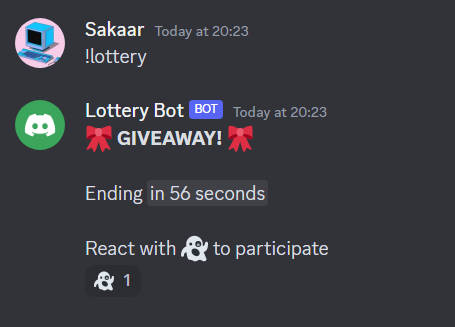
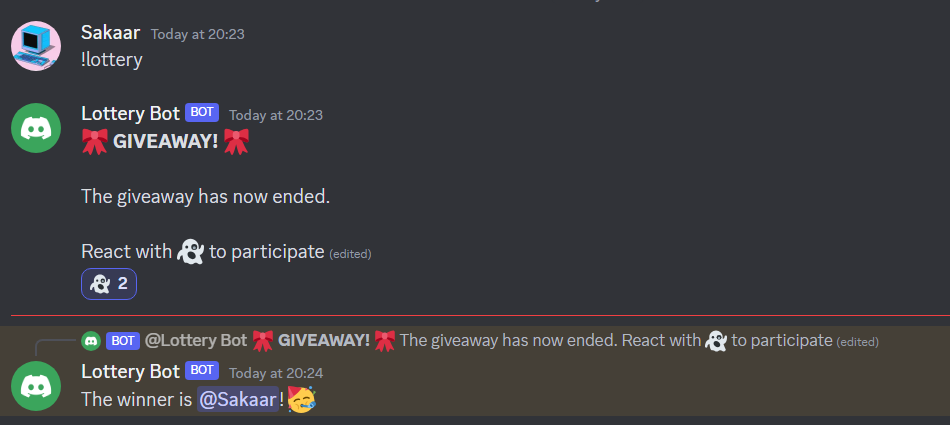

## Description
The Discord Lottery Bot is a Python-based bot designed to host giveaways in Discord servers. The bot uses the Discord.py library to create and manage the lottery. It allows users/admins to initiate a giveaway by typing "!lottery" in the server, and then the bot announces the giveaway with a set duration. Users can react to the giveaway message with a designated emoji to participate.

# Key Features:

- Giveaway Setup: Users/Admins initiate a giveaway by typing "!lottery" followed by the desired duration (in minutes) as a command in the server. eg !lottery 10 (Default is 1 min)
- Duration Control: The bot calculates the end time of the giveaway based on the specified duration and displays the end time in a user-friendly format. It edits the message once giveaway has ended.
- Participation: Users react to the giveaway message with a specific emoji (e.g., "👻") to enter the giveaway.
- Winner Selection: Once the giveaway duration ends, the bot randomly selects a winner from the participants who reacted to the giveaway message with the designated emoji.

# Images

# Usage
The bot requires a Discord bot token ("BOT_TOKEN_HERE") to run. Users should replace this placeholder with their actual bot token to use the bot in their Discord server.

